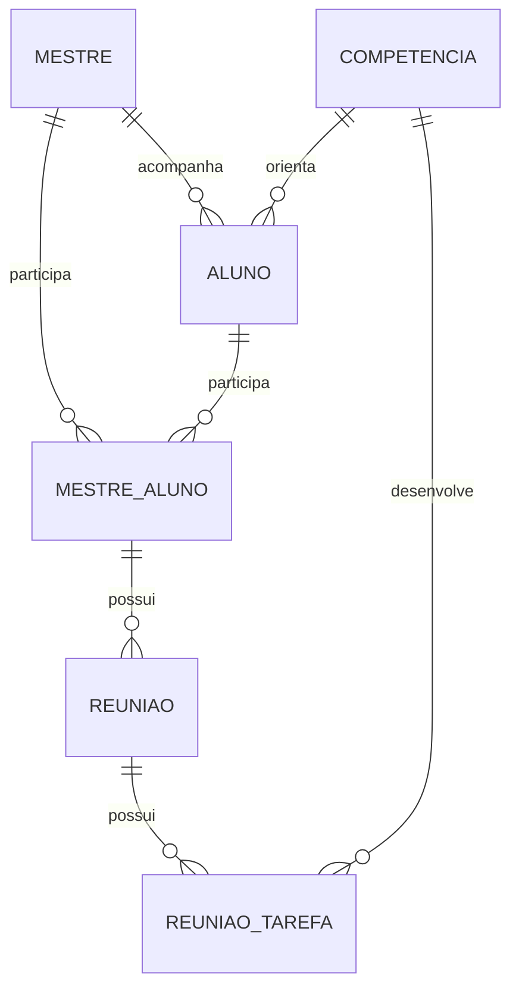
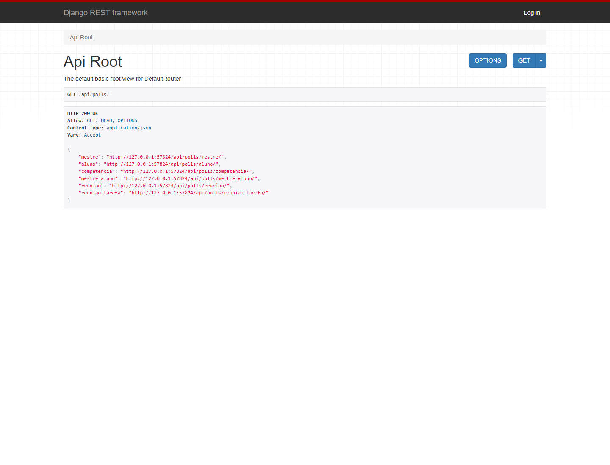
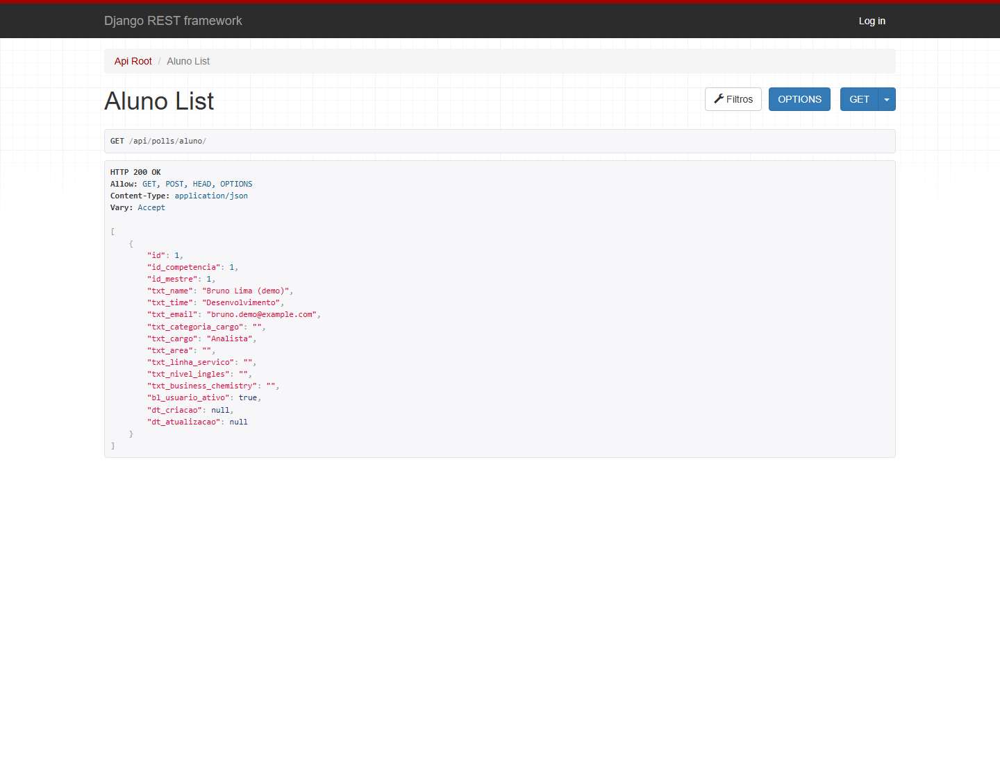
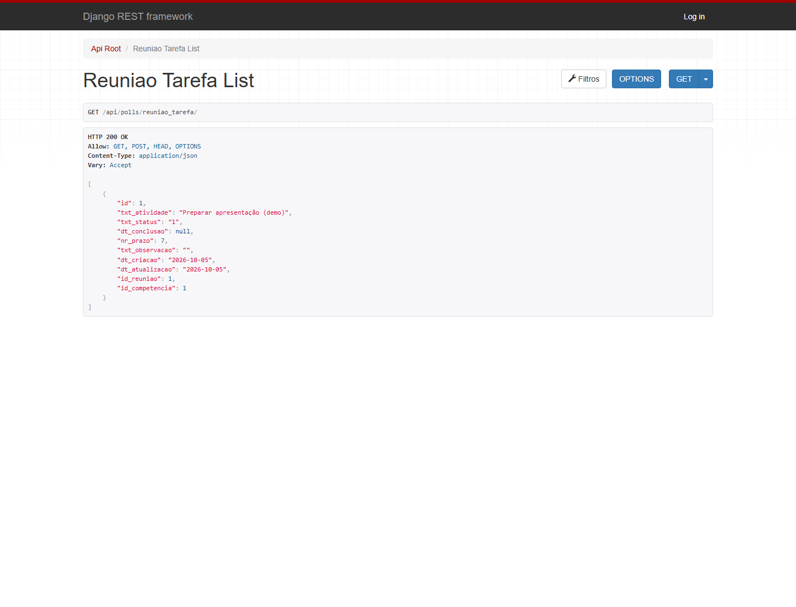

# Mentoria API

API REST para acompanhar programas de mentoria: mestres, alunos, competências, vínculos de acompanhamento, reuniões e tarefas. Construída com Django e Django REST Framework, inclui uma interface navegável para explorar os endpoints e o Django Admin para gerenciar os registros.

## Funcionalidades

- CRUD dos seis recursos, com relacionamentos protegidos contra exclusões acidentais.
- Leitura pública e escrita controlada pelas permissões de modelos do Django.
- Autenticação por sessão na interface navegável e Basic Authentication para clientes HTTP.
- Busca textual com `search` e ordenação com `ordering`.
- Validação de e-mail, chaves estrangeiras, status e prazo não negativo.
- Administração com busca, filtros e seleção de relacionamentos por autocomplete.
- Dados fictícios de demonstração, testes automatizados e integração contínua.

## Tecnologias

| Componente | Versão / uso |
| --- | --- |
| Python | 3.12 ou superior; verificado localmente com 3.13 |
| Django | 5.2.17 |
| Django REST Framework | 3.18.1 |
| SQLite | Banco padrão para desenvolvimento |
| GitHub Actions | Verificações com Python 3.12 e 3.13 |

As dependências estão fixadas em [requirements.txt](requirements.txt). O ambiente virtual deve ser criado na sua máquina.

## Executar localmente

Na raiz do projeto, usando PowerShell:

```powershell
python -m venv .venv
.\.venv\Scripts\python.exe -m pip install -r requirements.txt
.\.venv\Scripts\python.exe manage.py migrate
.\.venv\Scripts\python.exe manage.py createsuperuser
.\.venv\Scripts\python.exe manage.py seed_demo
.\.venv\Scripts\python.exe manage.py runserver
```

Os comandos usam diretamente o Python do ambiente virtual, dispensando a ativação e alterações na política de execução do PowerShell. `seed_demo` é opcional e pode ser executado novamente sem duplicar os registros de demonstração. Ele não cria usuários nem substitui registros existentes.

No Linux/macOS, substitua `.\.venv\Scripts\python.exe` por `.venv/bin/python`.

| Interface | Endereço local |
| --- | --- |
| Catálogo da API | <http://127.0.0.1:8000/api/polls/> |
| Administração | <http://127.0.0.1:8000/admin/> |
| Login da API navegável | <http://127.0.0.1:8000/api-auth/login/> |

A página inicial `/` redireciona para o catálogo. Este projeto fornece um backend com as interfaces do Django e do DRF; as capturas abaixo mostram essas interfaces em funcionamento.

## Configuração

As configurações são lidas das variáveis de ambiente. [.env.example](.env.example) documenta os valores disponíveis; copiar esse arquivo para `.env` **não o carrega automaticamente**.

| Variável | Padrão | Finalidade |
| --- | --- | --- |
| `DJANGO_DEBUG` | `true` | Desenvolvimento local; aceita `true`, `1` ou `yes` |
| `DJANGO_SECRET_KEY` | Chave local de desenvolvimento | Obrigatória quando `DEBUG=false` |
| `DJANGO_ALLOWED_HOSTS` | `localhost,127.0.0.1` | Hosts separados por vírgula |
| `DJANGO_DB_NAME` | `db.sqlite3` na raiz | Caminho para o banco SQLite |
| `DJANGO_TIME_ZONE` | `America/Sao_Paulo` | Fuso horário da aplicação |

Exemplo para usar outro banco local:

```powershell
$env:DJANGO_DB_NAME = Join-Path (Get-Location) 'demo.sqlite3'
.\.venv\Scripts\python.exe manage.py migrate
.\.venv\Scripts\python.exe manage.py seed_demo
.\.venv\Scripts\python.exe manage.py runserver
```

O idioma das interfaces está configurado como português brasileiro. Para implantação, configure `DJANGO_DEBUG=false`, uma chave secreta própria e os hosts do serviço; use HTTPS e um servidor WSGI/ASGI. Os cookies de sessão e CSRF exigem HTTPS com debug desativado. `runserver` destina-se ao desenvolvimento. Arquivos estáticos podem ser coletados com `python manage.py collectstatic --noinput`.

## Arquitetura

```text
endpoints_restframework/
├── api_test/                     # Configuração, URLs globais, WSGI e ASGI
├── polls/
│   ├── models.py                 # As seis entidades do domínio
│   ├── admin.py                  # Interface administrativa
│   ├── api/
│   │   ├── serializers.py        # Contratos e validação das entradas
│   │   ├── views.py              # ViewSets, consultas, busca e ordenação
│   │   ├── urls.py               # Router e compatibilidade dos detalhes antigos
│   │   └── exceptions.py         # Exclusão protegida → HTTP 409
│   ├── migrations/               # Histórico único, incluindo as renomeações
│   ├── management/commands/
│   │   └── seed_demo.py          # Dados fictícios de demonstração
│   └── tests.py                  # API, permissões, seed e migração legada
├── docs/
│   ├── screenshots/              # Capturas reais da aplicação
│   └── capture_screenshots.py    # Geração reproduzível das capturas
├── .github/workflows/tests.yml   # Verificação automática
├── .env.example
├── .gitignore
├── manage.py
└── requirements.txt
```

O domínio fica em uma única aplicação Django, `polls`, para manter as entidades relacionadas e as migrações no mesmo lugar. A camada HTTP está separada em `polls/api`. ViewSets e um router substituem as views e rotas repetidas. O nome `polls` foi mantido para preservar o histórico existente de migrações.

### Relacionamentos



O vínculo `MestreAluno` registra o par mestre/aluno e o ano fiscal. A reunião pertence a esse vínculo; cada tarefa pertence a uma reunião e a uma competência. As chaves estrangeiras usam `PROTECT`: exclua primeiro os registros dependentes quando necessário.

## Endpoints

Todos os recursos possuem listagem/criação e consulta/atualização/exclusão individual:

| Recurso | Lista e criação | Detalhe | Relacionamentos obrigatórios |
| --- | --- | --- | --- |
| Mestres | `/api/polls/mestre/` | `/api/polls/mestre/{id}/` | — |
| Alunos | `/api/polls/aluno/` | `/api/polls/aluno/{id}/` | `id_mestre`, `id_competencia` |
| Competências | `/api/polls/competencia/` | `/api/polls/competencia/{id}/` | — |
| Vínculos | `/api/polls/mestre_aluno/` | `/api/polls/mestre_aluno/{id}/` | `id_mestre`, `id_aluno` |
| Reuniões | `/api/polls/reuniao/` | `/api/polls/reuniao/{id}/` | `id_mestre_aluno` |
| Tarefas | `/api/polls/reuniao_tarefa/` | `/api/polls/reuniao_tarefa/{id}/` | `id_reuniao`, `id_competencia` |

- `GET` lista ou consulta; `POST` cria; `PUT` substitui os campos graváveis; `PATCH` atualiza parcialmente; `DELETE` exclui.
- Os detalhes antigos **sem barra final** continuam aceitando esses métodos diretamente.
- As listas mantêm o formato de array JSON, sem paginação, e a ordenação padrão por `id` decrescente.
- Os campos mantêm os nomes existentes (`txt_name`, `id_mestre` etc.). Datas usam `YYYY-MM-DD`.
- Em tarefas, `dt_criacao` e `dt_atualizacao` são automáticos e somente leitura. Nas demais entidades, essas datas continuam opcionais e graváveis.
- `txt_status` da tarefa aceita `"0"` (pendente), `"1"` (em andamento) ou `"2"` (concluído). `nr_prazo` representa dias e aceita zero ou um inteiro positivo, ou `null`.

### Autorização e respostas

Leituras são públicas. Para escrever, o usuário precisa estar autenticado e ter a permissão correspondente ao modelo: `add_*`, `change_*` ou `delete_*`. Um superusuário possui todas essas permissões. Usuários comuns podem receber permissões individuais ou via grupos no Admin.

| HTTP | Significado |
| --- | --- |
| `200` | Consulta ou atualização concluída |
| `201` | Registro criado |
| `204` | Registro excluído |
| `400` | Entrada inválida, incluindo relacionamentos inexistentes |
| `403` | Autenticação/permissão insuficiente ou falha de CSRF |
| `404` | Registro inexistente |
| `409` | Exclusão bloqueada por registros dependentes |

Com autenticação por sessão, operações de escrita exigem CSRF. O formulário da interface navegável cuida desse token. Para Basic Authentication, use HTTPS fora do ambiente local. Veja a [documentação de permissões do DRF](https://www.django-rest-framework.org/api-guide/permissions/) para o comportamento da política usada.

### Exemplos

Buscar mestres e ordenar pelo identificador:

```powershell
curl.exe "http://127.0.0.1:8000/api/polls/mestre/?search=Ana&ordering=id"
```

Criar um mestre no PowerShell; `-u admin` solicita a senha:

```powershell
$body = '{"txt_name":"Ana Martins","txt_email":"ana@example.com","txt_time":"Desenvolvimento","bl_usuario_ativo":true}'
$body | curl.exe -u admin -H "Content-Type: application/json" --data-binary '@-' "http://127.0.0.1:8000/api/polls/mestre/"
```

Exemplo de corpo para criar uma tarefa, usando IDs existentes:

```json
{
  "txt_atividade": "Preparar apresentação",
  "txt_status": "1",
  "nr_prazo": 7,
  "txt_observacao": "Apresentar o progresso na próxima reunião",
  "id_reuniao": 1,
  "id_competencia": 1
}
```

Os campos disponíveis e métodos aceitos também podem ser consultados com `OPTIONS` em cada endpoint.

## Banco existente e migrações

O histórico começa com a migração original `0001_initial`, que usa `coach`, `coachee` e `coach_coachee`. As novas migrações renomeiam essas entidades e suas chaves estrangeiras para a terminologia atual, preservando IDs, valores, relacionamentos e as permissões existentes de usuários/grupos.

Para atualizar uma instalação antiga, faça uma cópia do banco e aplique as migrações:

```powershell
Copy-Item db.sqlite3 db.backup.sqlite3
.\.venv\Scripts\python.exe manage.py migrate
```

Não apague as migrações antigas nem use `--fake` para contornar diferenças de esquema. O teste de migração cobre a atualização de dados legados, e o banco local original também foi conferido em uma cópia durante a reestruturação. Consulte a [documentação de migrações do Django](https://docs.djangoproject.com/en/5.2/topics/migrations/) para administrar o histórico.

O banco, os ambientes virtuais e os caches ficam fora do versionamento. Um clone novo cria o banco com `migrate`; use `seed_demo` para preencher dados fictícios.

## Verificações

```powershell
.\.venv\Scripts\python.exe manage.py check
.\.venv\Scripts\python.exe manage.py makemigrations --check --dry-run
.\.venv\Scripts\python.exe manage.py test
```

A suíte cobre CRUD dos seis recursos, detalhes com e sem barra, permissões, validações, exclusões protegidas, busca, ordenação, o comando de demonstração e a migração legada. Os testes usam um banco separado. O workflow executa essas verificações a cada push e pull request.


### Catálogo de endpoints



### Listagem de alunos



### Tarefas de reunião



Para regenerar as capturas, instale Chrome, Chromium ou Edge e execute:

```powershell
.\.venv\Scripts\python.exe docs/capture_screenshots.py
# Para informar o navegador manualmente:
.\.venv\Scripts\python.exe docs/capture_screenshots.py --browser 'C:\Program Files\Google\Chrome\Application\chrome.exe'
```
